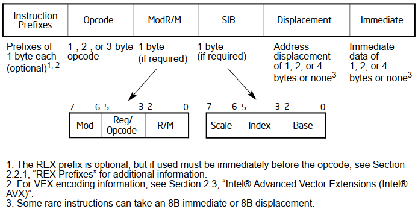

# Asm_Mimic
## A Mockup mimicing Assembler, for creating realtime-Assembler  
Develop Asm-code in your Visual Basic IDE, assembling and calling at run-time as a just-in-time-assembler
This is a first mockup working as a feasibility study.
Project started in dec.2020
Maybe have a look at the intel manual [i386](http://css.csail.mit.edu/6.858/2013/readings/i386.pdf) (old but small) and (big but new) [Intel® 64 and IA-32 Architectures Software Developer’s Manual](https://software.intel.com/content/dam/develop/public/us/en/documents/325462-sdm-vol-1-2abcd-3abcd.pdf)  

